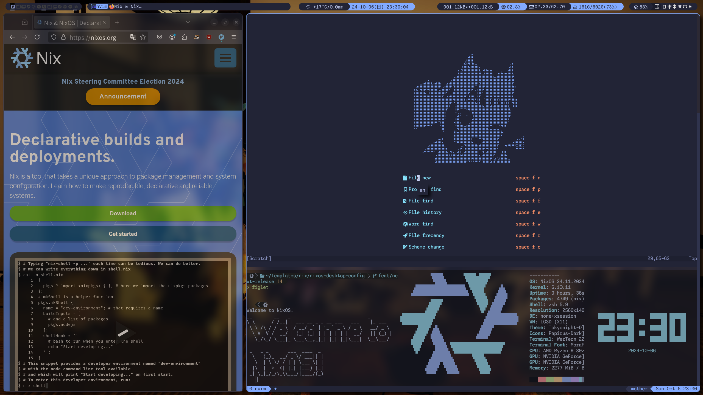
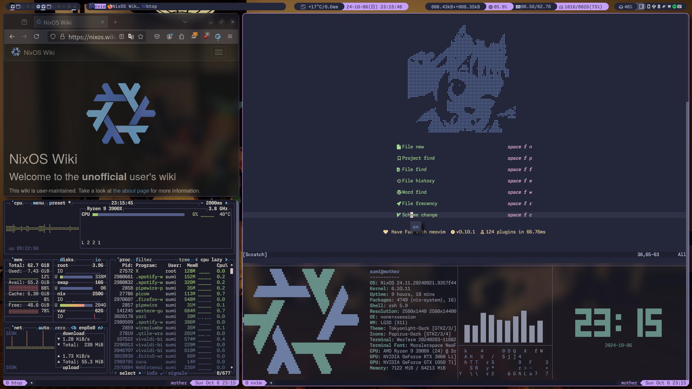
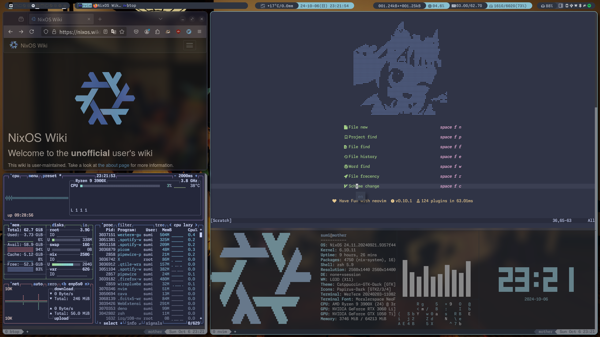
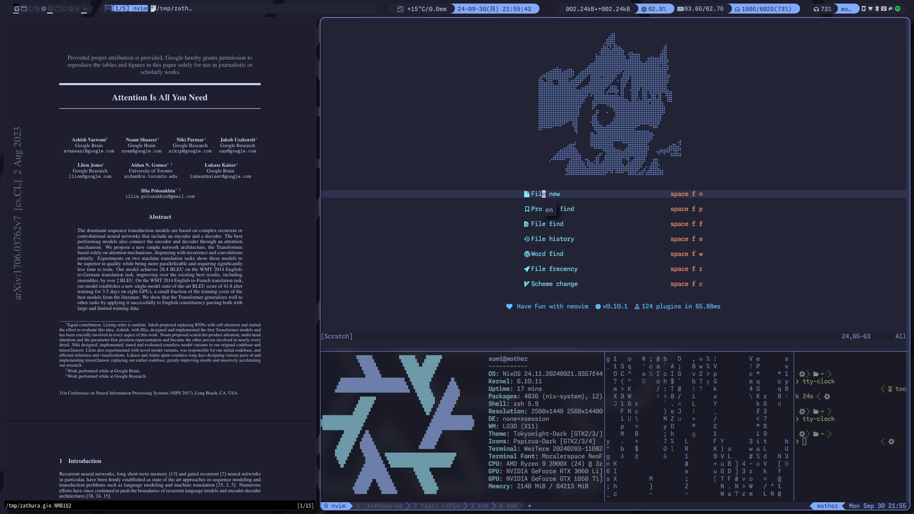

# misumisumi' NixOS & nix-darwin System Configuration & Home-Manager Configuration Flake

nix の世界へようこそ!!  
これは[misumisumi](https://github.com/misumisumi)のNixOSおよびhome-managerの設定です。



## 説明

- このリポジトリは[Nix Flakes](https://nixos.wiki/wiki/Flakes)によって管理されています。
- デスクトップ環境、CLI環境で試用することができます。
  - DE: Qtile or GNOME
- スタンドアローン[home-manager](https://github.com/nix-community/home-manager)のサポート
- 複数カラースキームのサポート

```nixos-desktop-config
├── apps
│   ├── color-theme  # color themes
│   ├── system       # system wide application configurations (NixOS options)
│   └── user         # user wide application configurations (home-manager options)
│       ├── cli          # settings of cli app
│       ├── core         # apps required for the minimum user environment
│       ├── desktop      # settings of desktop app
│       ├── presets  # environment presets
│       └── shell    # bash and zsh settings
├── machines         # settings for each my machines
├── modules          # my custom nixosModules and homeManagerModules
├── patches          # patch of package
├── settings         # common system settings
│   ├── system       # system wide
│   └── user         # user wide
├── sops             # secrets
└── users            # settings for each users
```

## Module Usage

詳細は[./machines/default.nix](./machines/home-manager.nix)または[./machines/home-manager.nix](./machines/home-manager.nix)を参照

```nix
{
  inputs = {
    dotfiles.url = "github:misumisumi/nixos-desktop-config"
    # ...
  };
  # ...
  # import nixosModules by inputs.dotfiles.nixosModules.<module-name>
  # import homeManageModules by inputs.dotfiles.homeManagerModules.<module-name>
  outputs = inputs@{...}: {
    homeConfigurations = {
      myenv = inputs.home-manager.lib.homeManagerConfiguration {
        ...
        extraSpecialArgs = {
          hostname = "nixos";
          user = "hogehoge";
          homeDirectory = "";
          schemes = [
            "presets/large"
          ];
          colorTheme = "tokyonight-moon"
          inherit inputs;
        };
        ...
      };
    };
  };
}
```

## Installation Guide

> [!WARNING]  
> 自分の環境で動くことに主眼を置いてメンテナンスしています。  
> `liveimg-*`及びスタンドアローン`home-manager`は十分にテストされていません。

### NixOS

1. `nix`環境の構築

- Container from [DockerHub (nixos/nix)](https://hub.docker.com/r/nixos/nix/tags)
- Install nix package manager from [official guide](https://nixos.org/download)
- Launch VM using [official iso](https://nixos.org/download)

2. ネットワーク接続の確認

   - run `ip -c a and ping 8.8.8.8`
   - wireless settings use `nmcli` or `wpa_supplicant`

3. インストール

   - リポジトリをcloneした場合は`--flake .#<flake-name>`に読み替える

#### Bootable External Disk

```sh
# 1. Create key file for luks
echo <password> > /tmp/luks.key

# 2. Edit `device` in machines/liveimg/filesystem

# 3. Check flake name (liveimg-cli-* or liveimg-<DE>-*, *-iso is for ISO creation, not use here)

# 4. Format disk and mount to `/mnt`
# "liveimg-cli" for CLI env, "liveimg-<DE>" for Desktop Environment
nix run nixpkgs#disko -- -m disko --flake "github:misumisumi/nixos-desktop-config#<flake-name>"

# Install NixOS to `/mnt`
nixos-install --no-root-passwd --flake "github:misumisumi/nixos-desktop-config#<flake-name>"
```

#### Create LiveCD

```sh
# 1. Check flake name (liveimg-*-iso)
# 2. Create .iso file (build takes a long time)
nix run nixpkgs#nixos-generators -- --format iso -o result --flake github:misumisumi/nixos-desktop-config#<flake-name>

# Write iso to device
dd if=result/iso/*.iso of=/dev/sdX status=progress
```

#### スタンドアローンhome-manager

1. Setup home-manager

- See [home-manager official manual](https://nix-community.github.io/home-manager/index.xhtml#sec-install-standalone)

2. Switch to config

```sh

  # Flace name is <preset> or <preset>-<shell>
  # For <preset>, `small` is CLI env, `medium` is CLI with texlive, and `huge` is GUI env.
  # <shell> is managed by home-manager, so choose something other than the user's default
  # no `-<shell>` does not include shell.
  home-manager switch --flake github:misumisumi/nixos-desktop-config#small-zsh
```

## Appendix

### System Compornents

- Common Compornents

|               |        Linux (GNOME)         |        Linux (Qtile)         |
| :-----------: | :--------------------------: | :--------------------------: |
| window system |        Wayland or X11        |             X11              |
|     Shell     |             Zsh              |             Zsh              |
|   Terminal    |           Wezterm            |           Wezterm            |
|    Editor     |            Neovim            |            Neovim            |
|    Browser    |      Vivaldi & Firefox       |      Vivaldi & Firefox       |
| Input Method  |      Fcitx5+mozc & skk       |         Fcitx5 & skk         |
|   Launcher    |             Rofi             |             Rofi             |
|     Theme     | catppuccin, nord, tokyonight | catppuccin, nord, tokyonight |
|  System Font  |        Noto Fonts CJK        |        Noto Fonts CJK        |

### Gallery

<h4 align="center">catppuccin-macchiato</h4>



<h4 align="center">nord</h4>



<h4 align="center">tokyonight-moon</h4>


